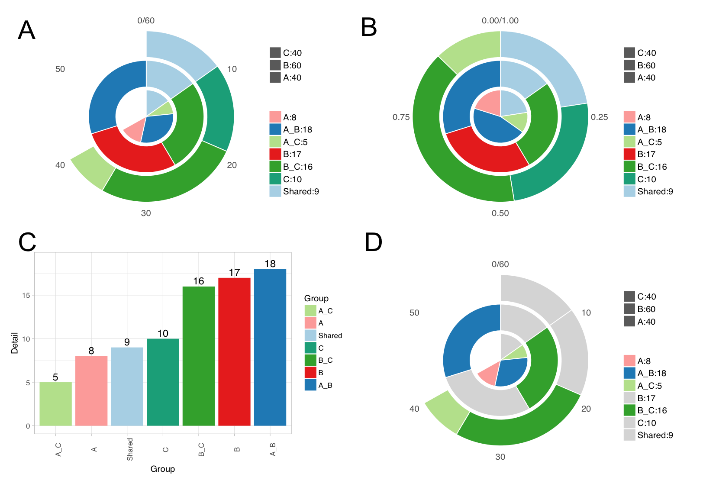

# VennDetail
[](http://www.repostatus.org/#active)
[](https://www.bioconductor.org/packages/devel/bioc/html/VennDetail.html#since)
[](https://github.com/guokai8/VennDetail)
[](https://www.bioconductor.org/packages/devel/bioc/html/VennDetail.html#archives)
[](https://bioconductor.org/checkResults/devel/bioc-LATEST/VennDetail/)

__VennDetail__ An R package for visualizing and extracting details of multi-sets 
intersection  


## Description

Visualizing and extracting unique (disjoint) or overlapping subsets of multiple 
gene datasets are a frequently performed task for bioinformatics. Although various 
packages and web applications are available, no R package offering functions to
extract and combine details of these subsets with user datasets in data frame is
available. Moreover, graphical visualization is usually limited to six or less 
gene datasets and a novel method is required to properly show the subset details.
We have developed __VennDetail__, an R package to generate high-quality Venn-Pie
charts and to allow extraction of subset details from input datasets.  

## Installation 
``` 
library(devtools)    
install_github("guokai8/VennDetail")
##Or install from Bioconductor
BiocManager::install("VennDetail")
``` 
## Getting started
```  
library(VennDetail)
A <- sample(1:1000, 400, replace = FALSE)
B <- sample(1:1000, 600, replace = FALSE)
C <- sample(1:1000, 350, replace = FALSE)
D <- sample(1:1000, 550, replace = FALSE)
res <- venndetail(list(A = A, B = B, C = C, D = D))
result <- result(res)
head(result)
```  
## Software Usage
```  
getSet(res, "A") # get unique elements in A
summary(res) #show overlap 'details' of all subsets
dplot(res) #make a bargraph for 'details'
dA <- data.frame(A = A, "FC" = rnorm(400))
dB <- data.frame(B = B, "FC" = rnorm(600))
dC <- data.frame(C = C, "FC" = rnorm(350))
dD <- data.frame(D = D, "FC" = rnorm(550))
getFeature(res, subset = "Shared", rlist = list(dA, dB, dC, dD), 
userowname = FALSE, gind = c("A", "B", "C", "D"))
###As all these four dataframes don't have row names, we set userowname to be FALSE
``` 
## Shiny web app 

[VennDetail](http://hurlab.med.und.edu/VennDetail/)
Note: Only support five input datasets now
## Contact information

For any questions please contact guokai8@gmail.com
