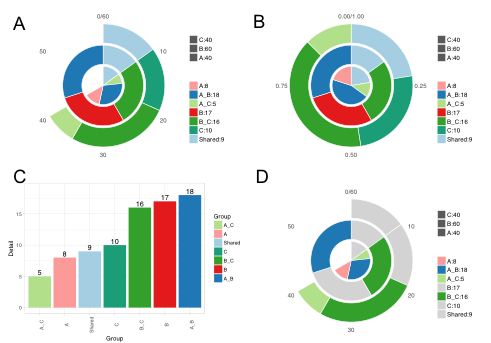

# VennDetail

Extract detail information from venn plot    


## Description

__VennDetail__ is a package can be used for extracting details(shared,unique sets) shown in the venn plot    

*** PS: Supports up to five-way Venn diagrams

## Dependencies

R>2.15  
VennDiagrm

## Installation
``` 
library(devtools)    
install_github("guokai8/VennDetail")
``` 
## Getting started
```  
library(VennDetail)
A <- sample(1:1000, 400, replace = FALSE);
B <- sample(1:1000, 600, replace = FALSE);
C <- sample(1:1000, 350, replace = FALSE);
D <- sample(1:1000, 550, replace = FALSE);
res<-venndetail(list(A=A,B=B,C=C,D=D),plot=TRUE);
result<-result(res);
head(res);
```  
### Some useful commands
```  
get(res,"A"); # get unique elements in A
detail(res); #show overlap 'details' of all groups
dplot(res); #make a bargraph for 'details'
dA=data.frame(A=A,"FC"=rnorm(400))
dB=data.frame(B=B,"FC"=rnorm(600))
dC=data.frame(C=C,"FC"=rnorm(350))
dD=data.frame(D=D,"FC"=rnorm(550))
getFeature(res,group="Shared",rlist=list(dA,dB,dC,dD),userowname=F)
###As all these four dataframes don't have row names, we set userowname to be FALSE
``` 

## Contact information

For any questions please contact guokai8@gmail.com
